# Tutorial-CLI-Azure-Wordpress
Tutorial Wordpress Cli Linux

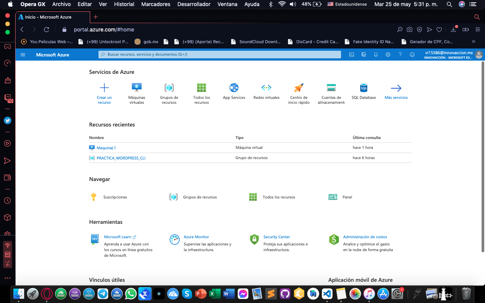
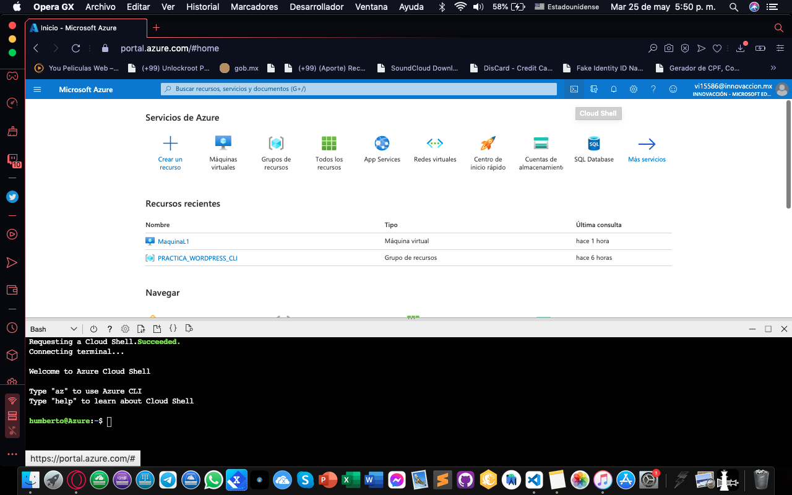

🐧
<h1>Como Instalar Wordpress En Ubuntu Server Azure</h1>

## Suplanta las palabras en mayúsculas con tu info
**Este es para obtener las listas de ubicaciones de servidores que tiene Azure**

    az account list-locations
    

    
  
**Con este creas un grupo de recursos dejar centralus**

    az group create --name NOMBRE_GRUPO_DE_RECURSOS --location centralus
    
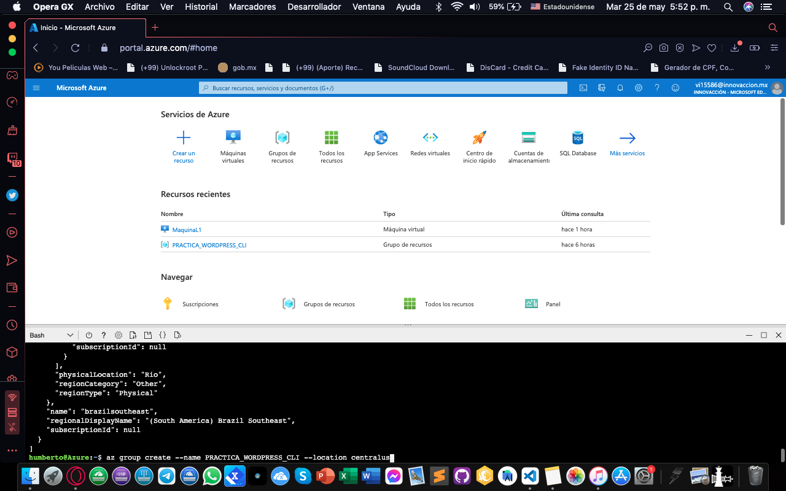
    
**Para crear una maquina virtual en tu grupo de recursos**
        
      az vm create \
        --resource-group NOMBRE_GRUPO_DE_RECURSOS \
        --location centralus \
        --name NOMBRE_MAQUINA_VIRTUAL \
        --image UbuntuLTS \
        --admin-username azureuser \
        --generate-ssh-keys     
  
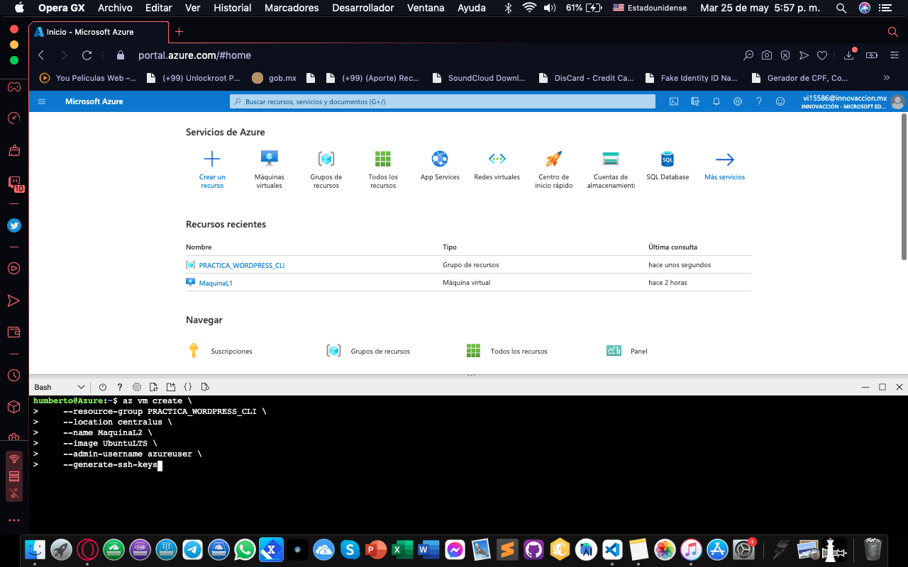

  **Copia aquí tu IP**
  
        publicIpAddress": "23.99.204.43
        
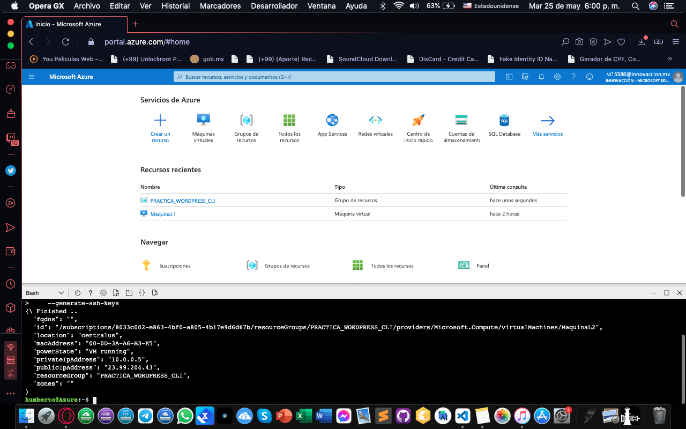

**Con este comando obtienes todas las direcciones IP de todas las maquinas virtuales de tu grupo de recursos**

        az network public-ip list --resource-group NOMBRE_GRUPO_DE_RECURSOS --query [].ipAddress
        
**Con este comando abres el puerto 80 que es necesario para que se funcione la conexion de la pagina** 

        az vm open-port --port 80 --resource-group NOMBRE_GRUPO_DE_RECURSOS --name NOMBRE_MAQUINA_VIRTUAL

**Con este comando accedes a la máquina virtual**

        ssh azureuser@TU_DIRECCION_IP
        
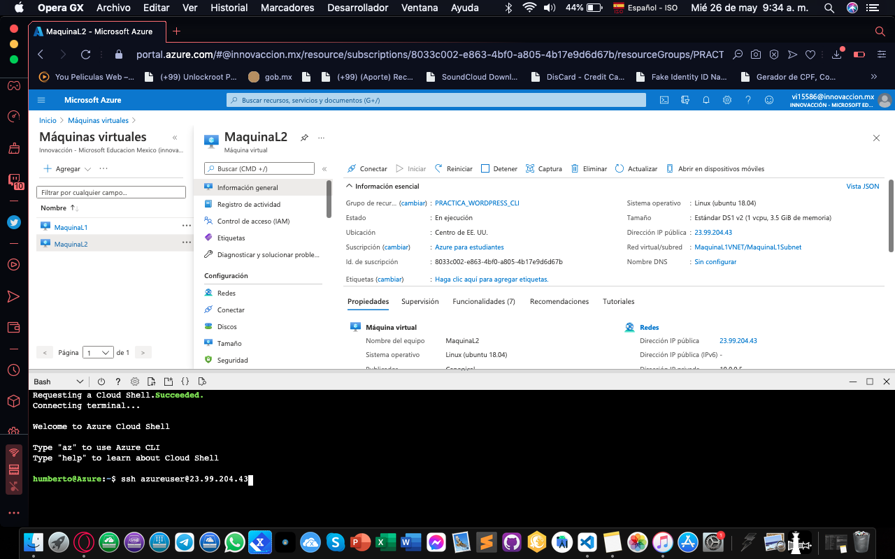
**Un comando de Prueba si la maquina funciona**

        sudo apt-get moo        
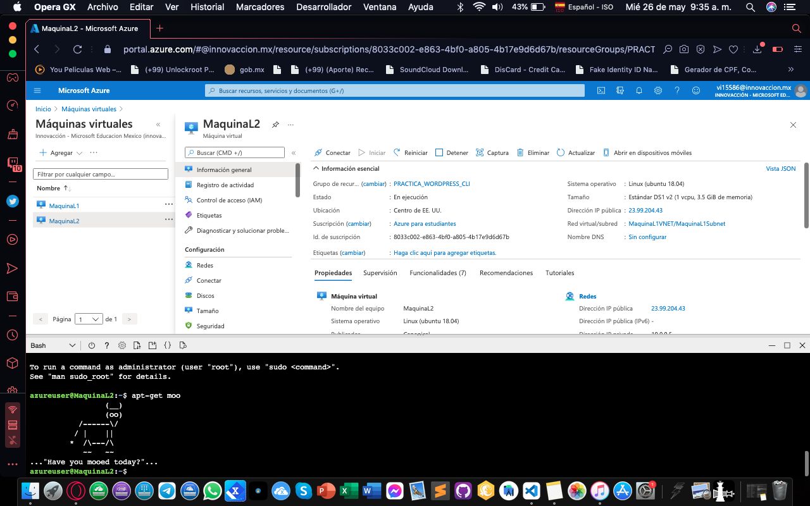        
**Con este comando actualizas la maquina**

        sudo apt-get update
        
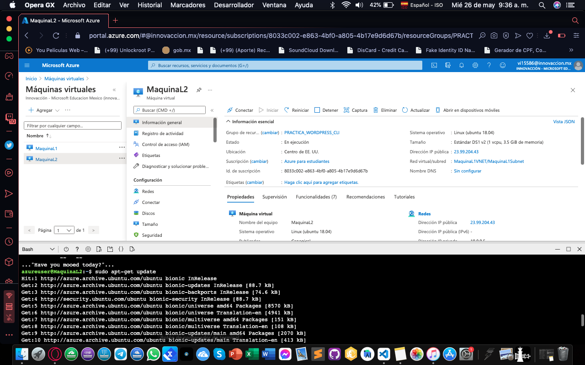 
 **Install Apache, PHP, and MySQL Para Poder Utilizar Wordpress**
 
LAMP (Linux, Apache, MariaDB y PHP) es un conjunto de aplicaciones ideales para el trabajo web y gestión de datos, en primer lugar, instalamos Apache si no lo tenemos con el siguiente comando:

    sudo apt install apache2
      
    
Todos los archivos de configuración de Apache2 están en el directorio /etc/apache2 y el archivo de configuración principal es /etc//etc/apache2/apache2.conf.

**Te da la versión de Apache y verifica si está bien instalado**

    apache2 -v  

Vemos el estado de Apache con el siguiente comando:

    sudo systemctl status apache2
    
Habilitamos Apache en el arranque de Ubuntu:

    sudo systemctl is-enabled apache2
    
Ahora instalaremos el gestor de base de datos el cual será MariaDB, para ello ejecutamos lo siguiente:

    sudo apt install mariadb-server mariadb-client
    
    
Comprobamos el estado de MariaDB:

    sudo systemctl status mariadb
    

Habilitamos su inicio desde el arranque:

    sudo systemctl is-enabled mariadb
    
El siguiente paso será asegurar la instalación de MariaDB con el siguiente comando:

    sudo mysql_secure_installation
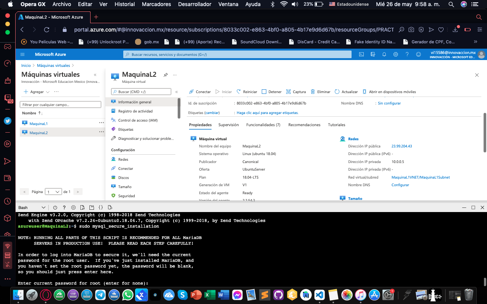    
    
Ingresamos la contraseña deseada para el usuario root y luego respondemos lo siguiente:
    
    Set a root password? [Y/n] y
    Remove anonymous users? [Y/n] y
    Disallow root login remotely? [Y/n] y
    Remove test database and access to it? [Y/n] y
    Reload privilege tables now? [Y/n] y  
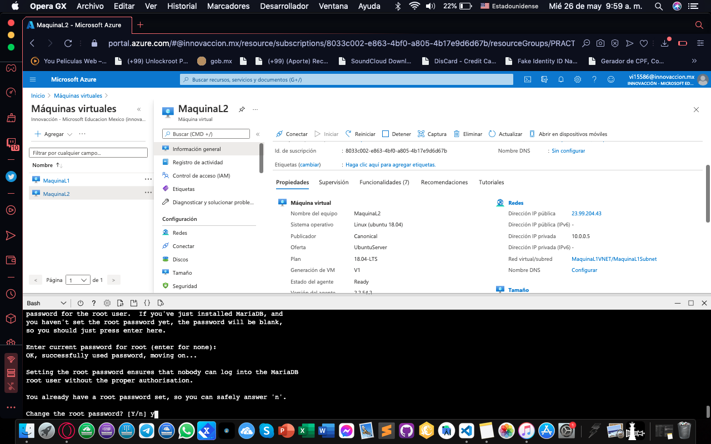
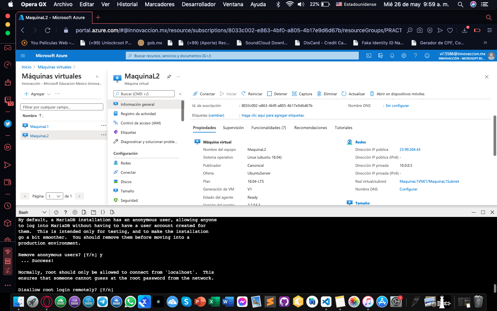
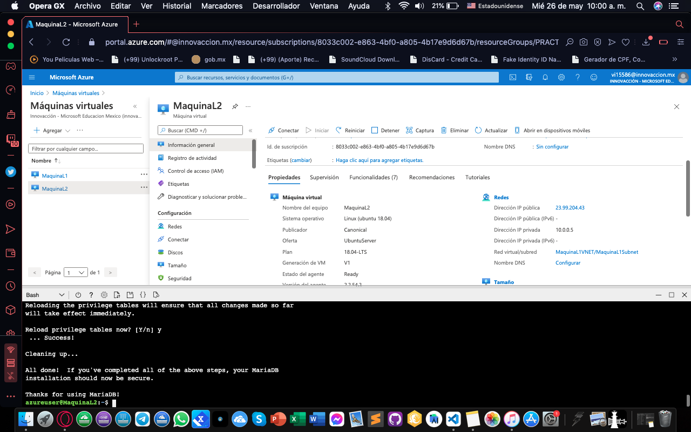
**Te da la versión de MySQL y verifica si está bien instalado**

    mysql -V

Finalmente instalamos PHP y sus complementos con el siguiente comando:

    sudo apt install php libapache2-mod-php php-mysql
    
    
**Te da la versión de PHP y verifica si está bien instalado**

    php -v
    
 
**Crear base de datos para wordpress**

Lo primero conectar con el motor de BBDD, con un usuario con privilegios para crear otros usuario y bases de datos, suele ser el usuario root

    sudo mysql -u root -p
    
(pedirá la clave).
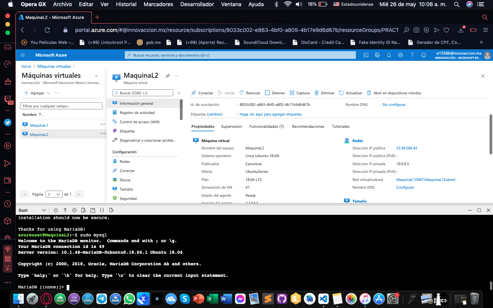

Una vez dentro podemos ver las bases de datos

    show databases;
    
Para crear el usuario:

    CREATE USER 'usuario'@'localhost' IDENTIFIED VIA mysql_native_password;
    
   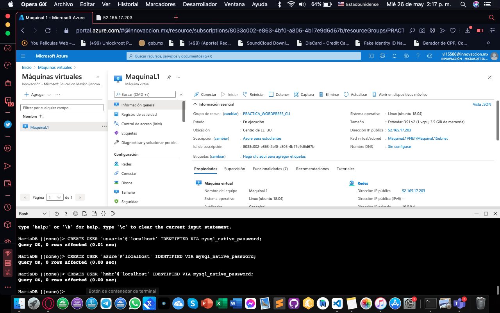
🐧 Ahora le establecemos una password:

    SET PASSWORD FOR 'usuario'@'localhost' = PASSWORD('patata');
   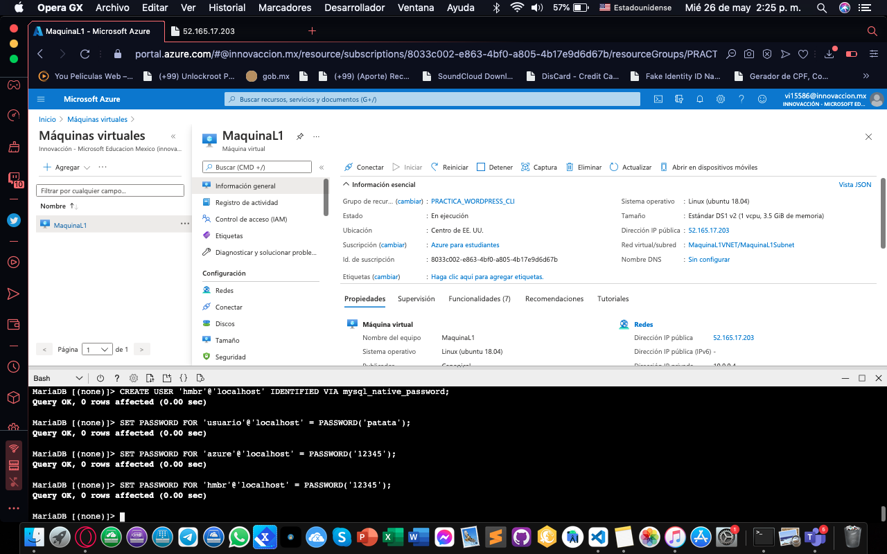 
🐧 Creamos la base de datos:
      
    CREATE DATABASE IF NOT EXISTS `usuario`;
  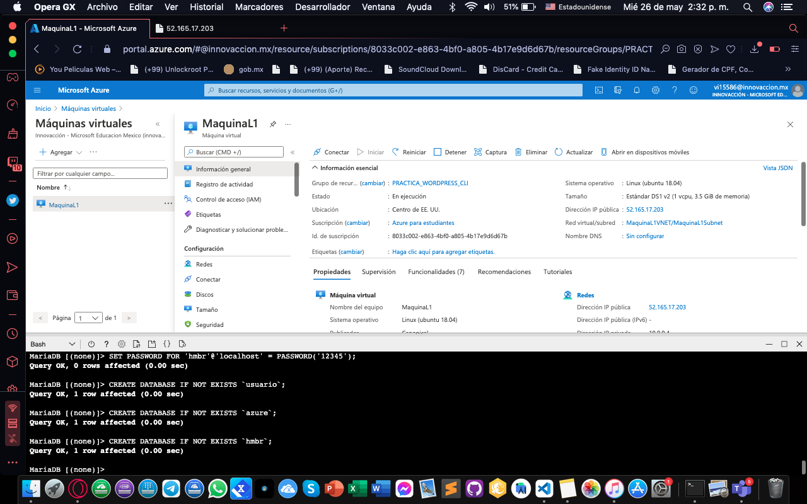  
🐧 Le damos todos los privilegios sobre esta base de datos al usuario recién creado:
    
    GRANT ALL PRIVILEGES ON `usuario`.* TO 'usuario'@'localhost';
    
🐧 Obtener la lista de los usuarios de MySQL.

    SELECT user FROM mysql.user;
   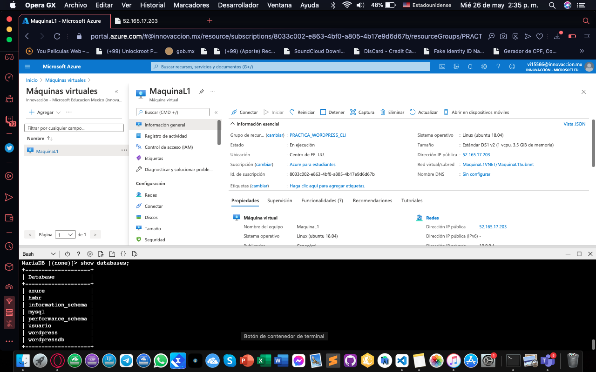
   
  Salimos de mysql 
  	
	quit
 **Descargar archivo de WordPress Linux**
 
En primer lugar, vamos a descargar la última versión de WordPress con el siguiente comando:

    sudo wget -c http://wordpress.org/latest.tar.gz

Una vez descargada vamos a extraer su contenido con el siguiente comando:

    sudo tar -xzvf latest.tar.gz
    
El siguiente paso será mover el directorio de WordPress que hemos extraído a la raíz del documento web, la cual esta en la ruta /var/www/html/, allí vamos a ejecutar lo siguiente:

  (listamos el contenido)
        
        ls -l
  (copiamos el contenido a nuestro sitio)
        
        sudo cp -R wordpress /var/www/html/solvetic.lan
        
   (verificamos el contenido) 
   
        ls -l /var/www/html/

**Ahora vamos a configurar los permisos en el directorio del sitio web el cual es /var/www/html/solvetic.lan, estos permisos involucran que debe ser propiedad del usuario y del grupo de Apache2 www-data:**

🐧
    
    sudo chown -R www-data:www-data /var/www/html/solvetic.lan
    
🐧    

    sudo chmod -R 775 /var/www/html/solvetic.lan
    
**Vamos a la a la raíz de documentos del sitio web y allí vamos a crear un archivo wp-config.php tomando como origen el archivo de configuración de la siguiente manera:**

        cd /var/www/html/solvetic.lan
        sudo mv wp-config-sample.php wp-config.php
        
  **Abrimos el archivo de configuración con el editor deseado:**
  
        sudo nano wp-config.php
        
        
  **Debemos ir a las siguientes líneas:**
  
DB_NAME
DB_USER
DB_PASSWORD
 

Establecemos el nombre y contraseña creados en la base de datos:

Guardamos los cambios y salimos del editor con las teclas Ctrl + X.

Se requiere configurar el servidor web Apache para que aloje el sitio de WordPress con el nombre de dominio.

Para ello debemos crear un host virtual y establecer la configuración de Apache, ejecutamos lo siguiente:

        sudo nano /etc/apache2/sites-available/solvetic.lan.conf
        
 En el archivo ingresaremos lo siguiente:
 
        <VirtualHost *:80>
			ServerName solvetic.lan
			ServerAdmin webmaster@localhost
			DocumentRoot /var/www/html/solvetic.lan
			ErrorLog ${APACHE_LOG_DIR}/error.log
			CustomLog ${APACHE_LOG_DIR}/access.log combined
    </VirtualHost>
**Guardamos los cambios y salimos del editor con las teclas Ctrl + X.

Vamos a verificar que la configuración de Apache y su sintaxis sea correcta, en caso de ser así, vamos a habilitar el nuevo sitio y cargar el servicio apache2 para aplicar los nuevos cambios que hemos realizado:

    apache2ctl -t
    sudo a2ensite solvetic.lan.conf
    sudo systemctl reload apache2

Después de esto vamos a desactivar el host virtual por defecto con el fin de permitir que nuevo sitio sea cargado de forma correcta desde el navegador web, ingresamos lo siguiente en la terminal:

    sudo a2dissite 000-default.conf
    sudo systemctl reload apache2
    
 Cómo acceder a WordPress y finalizar configuración
 colocamos en el explorador la ip de nuestra maquina
 
    52.165.17.203
    
 En la ventana inicial seleccionamos el idioma a usar:
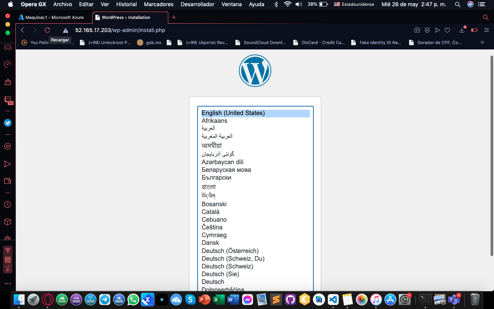
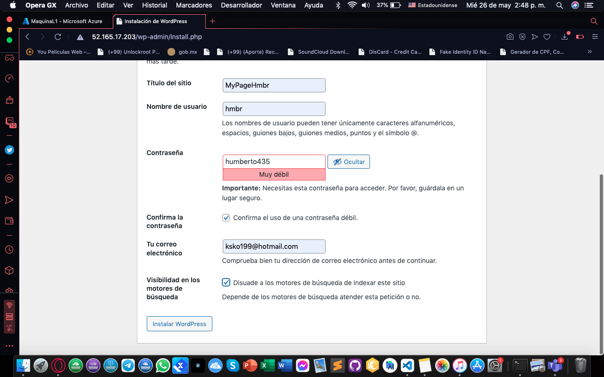
Damos clic en Continuar y a continuación ingresamos el nombre del sitio, el usuario y podemos dejar la contraseña asignada por WordPress, si es así debemos copiarla debido a su complejidad:
 
Completamos los datos solicitados y damos clic en “Instalar WordPress” para completar el proceso:
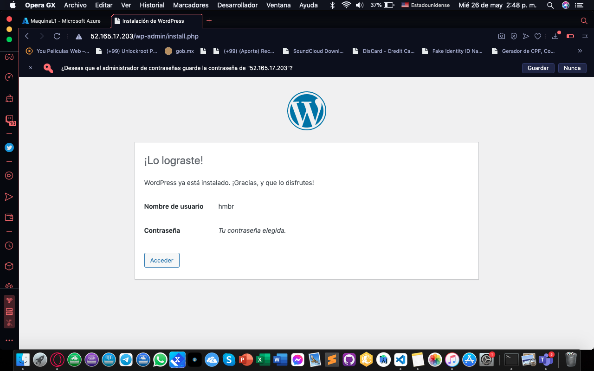 
 
Damos clic en Aceptar y seremos redireccionados a la pagina de inicio de sesión de WordPress: 

Clic en “Acceder” y este será el entorno de WordPress
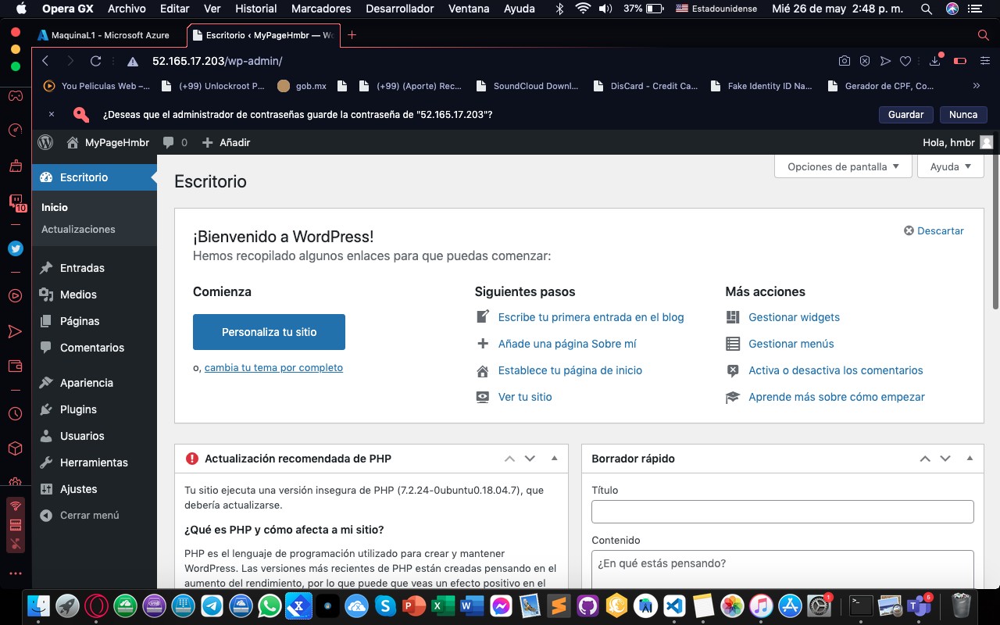

[Practica WORDPRESS Maquina Virtual Linux 🐧 ](README2.md)
